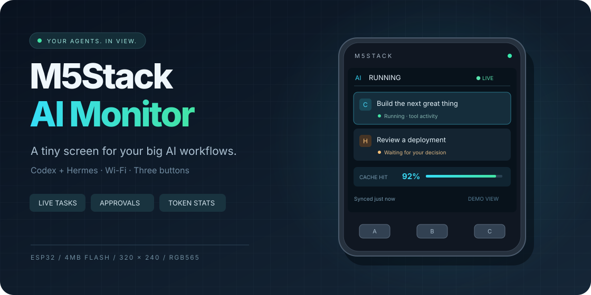
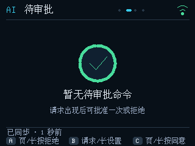
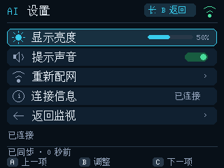
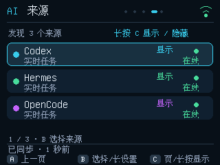
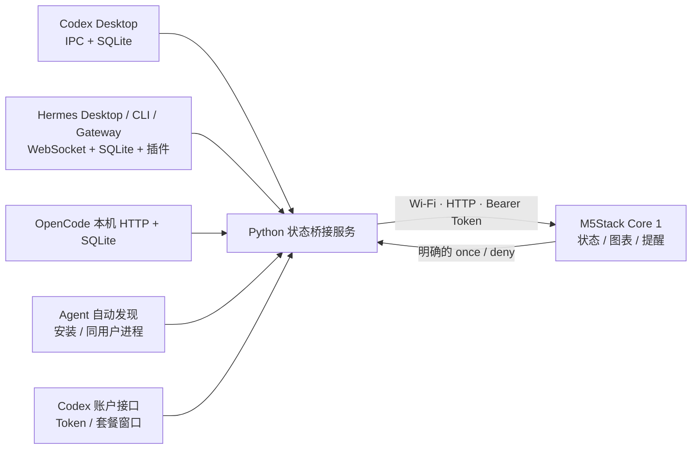

<div align="center">



# M5Stack AI Monitor

**让 AI 在电脑里工作，让进度在桌面上发光。**

把 M5Stack Core 一代变成 Codex / Hermes / OpenCode 的桌面状态屏。<br>
运行任务、待审批命令、Token 图表、缓存命中、套餐额度与主机状态——抬眼就能看到。


[功能](#-一块小屏五个视角) · [快速开始](#-快速开始) · [按钮操作](#-三个按钮就够了) · [技术说明](docs/USAGE.md) · [实机验证](VALIDATION.md)

</div>

> 横幅为设计示意，使用虚构任务与指标；下方截图来自 Core 一代实际 LCD。

## ✨ 一块小屏，五个视角

| 视角 | 你能看到什么 |
| :--- | :--- |
| **LIVE · 运行** | 正在工作的 Codex / Hermes / OpenCode 任务，当前动作、耗时、摘要与输入等待。 |
| **ACTION · 审批** | 待处理命令与按住确认进度；批准当前一次，或者拒绝。 |
| **STATS · 用量** | 七日 Token 柱状图、输入 / 输出数、缓存命中率；切换查看 Codex 套餐窗口。 |
| **HOST · 主机** | CPU / 内存实时双曲线、默认出口网卡收发速率、根磁盘占用、系统负载与开机时间。 |
| **LINK · 来源** | 自动发现本机 Agent、查看采集健康度；按来源显示或隐藏任务与图表。 |

设置使用独立入口：亮度、声音、重新配网、连接信息。普通切页不会进入设置，退出后回到原页面。

<table>
<tr>
<td align="center"><br/><b>等待行动时，再占用你的注意力</b></td>
<td align="center"><br/><b>中文界面 · 亮度可调 · 随时静音</b></td>
</tr>
</table>

- **自动发现**：Codex、Hermes、OpenCode，以及 Claude Code、Gemini CLI、Aider、Goose、Amp、Cursor Agent；来源页按 B 选择、长按 C 显示/隐藏，设备保存选择。
- **OpenCode 接入**：优先读取本机 v2 会话状态与 SQLite 用量，兼容 v1 只读状态接口；其审批与提问在电脑处理。其他 Agent 当前提供安装/数据存在与进程在线检测。
- **两秒刷新**：正常网络下持续轮询，HTTP 在独立任务中运行，按钮与绘制不等待网络超时。
- **主机趋势**：两秒采样一次，最多保留六十个点；CPU / 内存按 0–100% 绘图，网络纵轴自动缩放。
- **声音有含义**：完成一声，等待操作两声，失败三声；首次连接不重播历史提醒。
- **链路自恢复**：连续三次传输失败会重新接入 Wi-Fi，每分钟最多一次；保留配网与最后数据。认证或数据格式错误不会触发无线重连。
- **断线保留现场**：超过十秒没有有效快照，保留最后画面并显示数据过期；恢复后自动同步。
- **手机配网**：临时热点、屏幕随机密码、浏览器配置，Wi-Fi 与监视 Token 存入 NVS。
- **图形界面**：深色卡片、来源徽标、柱状图、额度环与进度条，搭配切页动画。

### 来源支持范围

| 来源 | 任务状态 | 用量 / 套餐 | 设备响应审批 |
|---|---|---|---|
| Codex Desktop | 实时状态、审批、输入等待 | Token、缓存、账户额度 | 命令 once / deny |
| Hermes | Desktop 实时与 CLI/Gateway 插件 | 本机会话 Token / 缓存；额度未知 | 支持的命令 once / deny |
| OpenCode | v2 HTTP + 明确持久化结果；v1 HTTP 状态 | v2 本机会话 Token / 缓存；额度未知 | 在电脑处理 |
| Claude Code / Gemini CLI / Aider / Goose / Amp / Cursor Agent | 安装或本地数据发现、进程在线；任务未知 | 未接入 | 在电脑处理 |

<p align="center"></p>

OpenCode 默认自动定位同一用户进程的本地监听端口，服务密码仅在主机使用。自定义路径和地址见 [使用手册](docs/USAGE.md#agent-自动发现与-opencode)。

## 🧠 小设备，本机大脑



屏幕拿到的是整理后的状态与指标。Codex / Hermes / OpenCode 账号凭据留在主机；设备使用独立的监视 Token。

## 🚀 快速开始

当前面向 **Linux + systemd 用户服务**，主机与设备需要在同一可信局域网。已在 **M5Stack Core 一代、ESP32、4MB Flash** 上验证；不使用 PSRAM。

需要 Python 3.12、PlatformIO、原生 C++ 编译器，以及已经登录运行的 Codex Desktop、Hermes 和 / 或 OpenCode。图形诊断工具另需 Pillow。

### 1. 安装主机服务

```bash
git clone https://github.com/lipu0324/m5stack-ai-monitor.git
cd m5stack-ai-monitor

python3.12 -m venv .venv
.venv/bin/python -m pip install -r host/requirements.txt
.venv/bin/python tools/install-host.py
```

安装器生成随机监视 Token，启用 `ai-monitor.service`，默认监听 **8766**。若已安装 Hermes CLI，还会安装并启用监视插件；现有 AI 任务不会被重启。配置与配网信息位于：

```text
~/.config/ai-monitor/config.json
~/.config/ai-monitor/pairing.txt
```

### 2. 备份，再烧录

先安装 PlatformIO CLI 与 esptool。连接 USB，并确认自己的串口；以下使用 `/dev/ttyUSB0`：

```bash
export AI_MONITOR_PORT=/dev/ttyUSB0

# 保存完整 4MB Flash，包括原程序及可能存在的私有 NVS
bash tools/backup-device.sh

pio run
.venv/bin/python tools/check-firmware-stack.py
pio run -t upload --upload-port "$AI_MONITOR_PORT"
```

固件使用 3MB 程序分区，烧录速度 **115200**。更新保留 NVS；当前没有双镜像 OTA。串口权限不足时，可运行 `bash tools/enable-serial-access.sh`，脚本会在本地请求 sudo。

### 3. 手机连接设备

1. 连接屏幕显示的 `AI-Monitor-XXXX` 热点，使用屏幕上的随机密码。
2. 打开 **http://192.168.4.1**，填写 **2.4GHz Wi-Fi**、服务地址与监视 Token。
3. 服务地址使用 `pairing.txt` 中的 LAN IP，例如 `http://192.168.1.10:8766`。
4. 新配置经过联网和认证验证后才保存，随后关闭热点；失败时保留旧设置。

主机页按 B 在 CPU / 内存和网络流量之间切换。默认统计 IPv4 默认路由对应的单张网卡，可在本地 config.json 设置 `host_interface` 指定网卡。流量使用字节/秒，K/M 分别表示 KiB/MiB；内存占用按 MemAvailable 计算，磁盘指根分区。首次采样和计数重置时速率显示未知，不伪造 0。

主机防火墙需允许设备访问服务端口。配网文件与 Flash 备份包含私有配置，已在 `.gitignore` 中排除。

## 🎮 三个按钮，就够了

| 操作 | 结果 |
| :--- | :--- |
| **A / C 短按** | 上一页 / 下一页，循环只包含五个监视页面。 |
| **B 短按** | 切换任务 / 审批；用量页切换已显示来源；来源页选择来源；主机页切换资源 / 网络。 |
| **C 长按 0.8 秒** | 运行页查看任务详情；用量页切换 Token / 套餐视图；来源页显示 / 隐藏。 |
| **B 长按 2 秒** | 进入设置 / 返回原页面。 |
| **设置内 A / C、B** | 选择项目、调整；也可选择“返回监视”退出。 |
| **审批页 C 长按 2 秒** | 批准选中命令的**当前这一次**。 |
| **审批页 A 长按 2 秒** | 拒绝选中请求。 |
| **A + C 长按 5 秒** | 重新开启配网。 |

审批会复核请求 ID，并拒绝过期、重复或不完整请求。设备不提供整会话 / 永久放行，不发送提示词或控制任务启停；输入问题、文件变更、权限扩展及不支持的审批需要回到电脑处理。

## 📊 指标说清楚，图表才有用

| 指标 | 数据范围与含义 |
| :--- | :--- |
| Codex 会话输入 / 输出 / 缓存 | 当前加载的本机桌面会话累计值。缓存命中率 = 缓存输入 ÷ 总输入。 |
| Codex 七日 Token / 套餐额度 | 来自已登录账户接口，可包含其他设备使用，存在更新延迟。Token 数与额度百分比独立展示。 |
| Hermes 用量 / 缓存 | 来自本地会话数据库。输入分母含非缓存输入、缓存读取与缓存写入；命中分子为缓存读取。 |
| OpenCode v2 用量 / 缓存 | 本机全部会话累计字段；输入含缓存读取与写入，七日图按会话开始日归属；套餐额度未知。 |
| Hermes 七日图 | 整个会话用量按会话开始日归属，当前日期边界为 UTC+8；不是逐调用日统计。 |
| Hermes 套餐额度 | 当前无可靠来源，显示不可用，不以 0% 替代未知。 |

Codex 状态使用**现有 Desktop IPC**；独立 `codex app-server` 仅用于读取账户用量。桌面内部 IPC 与 Hermes 桥接接口随版本变化，接入失败时显示来源健康度和可确认的信息。未加载插件的既有 Hermes CLI 会话，不能仅凭未关闭就判断正在运行。

## ⚙️ 针对 4MB Core 一代的实现

- **320×40 RGB565 分块缓冲**：25,600 字节，保持完整色彩，仅推送发生变化的块；为 TCP 接收与声音 DMA 留出空间。
- **真实可用内存诊断**：按内部 8 位可访问内存统计余量，排除不能用于网络字节缓冲的 IRAM。
- **独立网络任务**：两秒抓取一次，失败后递增重试，最长三十秒。
- **流式读取 + 固定解析区**：启动时预留并复用 32KB JSON arena；按 Content-Length 流式解析正文，确认实际字节数，避免反复申请整份正文 String。
- **有界 Hermes 插件队列**：钩子异步写元数据，插件故障不阻塞 AI 任务。
- **受限接口**：每页最多十个任务、二十个最近事件，快照上限 16KB。

锁定工具链：Espressif32 **6.7.0** · Arduino ESP32 **2.0.16** · M5Unified **0.2.25** · M5GFX **0.2.32** · ArduinoJson **6.21.5**。

## 🧪 验证与诊断

```bash
# 本地逻辑与真实导航状态机：55 项测试
.venv/bin/python -m unittest discover -s tests -v

# 读取已有本机来源，不发送模型消息
.venv/bin/python tools/verify-live.py

# 固件栈帧与 USB 健康信息
.venv/bin/python tools/check-firmware-stack.py
.venv/bin/python tools/device.py info
```

已实机验证设置页进出、服务断开与恢复、Wi-Fi 保留配置、中文图形界面，以及真实等待输入提示 / 两声提醒 / 响铃后持续同步。远程审批的精确请求与防重放已通过测试；真实待审批请求的端到端验收仍待完成。**八小时观察已取消**，不将短测包装为长期稳定性结论。

`tools/review-agents-ui.py` 可短测来源发现、隐藏、用量切换和 NVS 保存，不启动 AI 任务。

`tools/check-http-recovery.py` 可短测主机双请求、切页和播放声音后的同步，会播放三声测试音（遵循静音设置）；原生接收器测试需要先执行 `pio run` 安装 ArduinoJson。

`tools/check-byte-heap.py --seconds 180` 针对响铃、图表和 HTTP 双请求复测，并检查可用于字节缓冲的真实内存余量。Linux USB 诊断工具不切换复位引脚，保留故障现场；完整 LCD 截图可能含配网密码，默认保留在私有目录。更多接口、数据语义和诊断说明见 [使用手册](docs/USAGE.md) 与 [验证记录](VALIDATION.md)。

## 📁 项目结构

```text
src/                 ESP32 固件、图形界面与导航状态机
host/                状态采集、用量、审批转发与 HTTP 服务
hermes_plugin/       Hermes CLI / Gateway 异步监视插件
tests/               后端、审批、提问与导航测试；脱敏样本
tools/               安装、备份、实机验证与诊断工具
docs/                使用手册与公开展示资源
```

本项目使用 [MIT License](LICENSE)。欢迎带着具体设备型号、来源版本和脱敏复现信息提出 Issue 或 PR。
